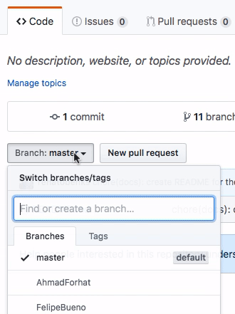
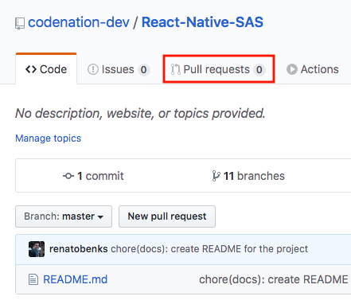
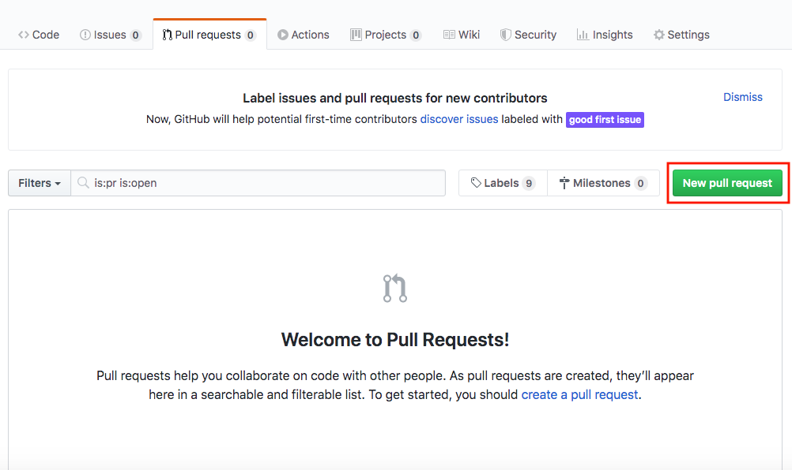
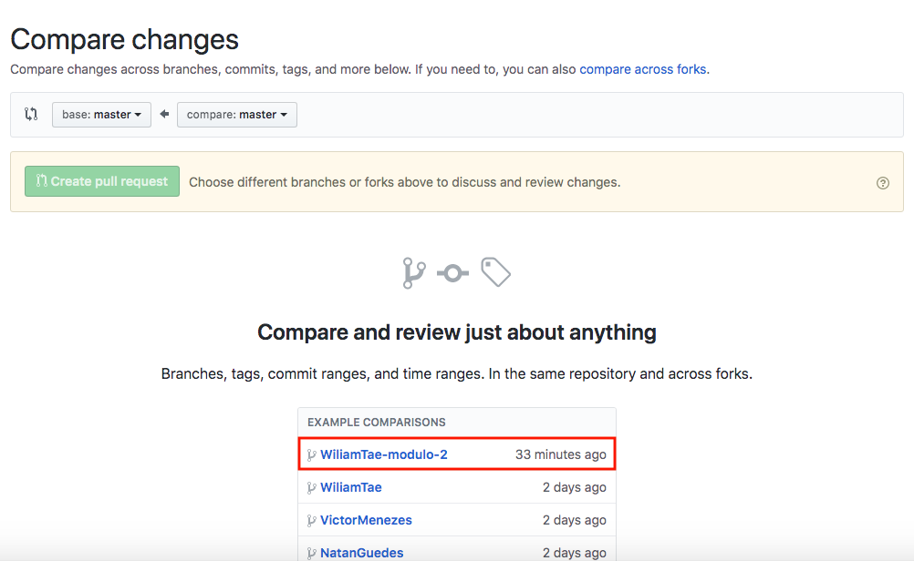
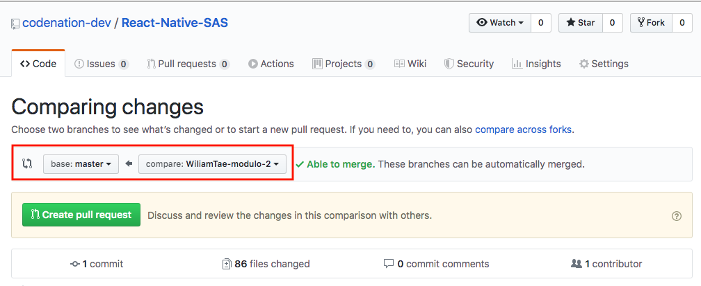
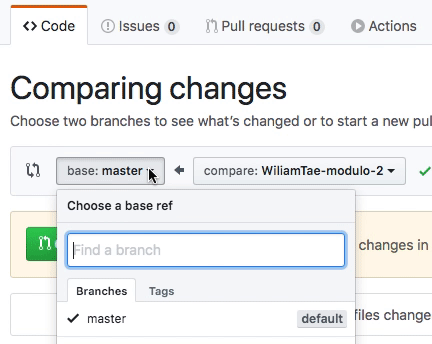
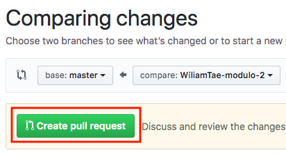

# #AceleraDev > React Native SAS

Projeto destinado para centralizar o codigo dos desafios
feito durante as aulas que aconteceram durante o programa #AceleraDev
de React Native com o apoio da plataforma SAS.

Para a correta contribuição nesse repositório, e consequetemente, uma
correta avaliação do seu desempenho, é necessário que você leia atentamente
as instruções abaixo e as use corretamente.

Instruções
---

1. [Preparando o ambiente](#preparando-o-ambiente)
2. [Começando a contribuir](#comecando-a-contribuir)
3. [Criando a solução](#criando-a-solucao)
4. [Submetendo a solução](#submetendo-a-solucao)

### Preparando o ambiente

- Primeiramente, você deve clonar o projeto através do comando abaixo:

```bash
$ git clone git@github.com:codenation-dev/React-Native-SAS.git
```

- Após clonar o repositorio, você deve entrar na pasta do projeto clonado,
com o seguinte comando:

```bash
$ cd React-Native-SAS/
```

- Assim que você tiver na pasta do seu projeto clonado em seu ambiente, você deve
alterar a branch atual do seu projeto, que será a branch `master`, para a branch que
você usará para trabalhar nas soluções dos desafios, a branches estão com os seus nomes.
Então você deve primeiramente, procurar qual o nome corretamente da branch, com o seu nome,
através do GitHub, conforme a imagem abaixo:

> Para verificar corretamente qual a sua branch no repositorio basta abrir o repositorio
no GitHub [aqui](https://github.com/codenation-dev/React-Native-SAS), e abrir as 
as opções de branches do projeto, assim como mostrado abaixo



- Após você encontrar corretamente o nome da branch corespondente ao seu nome, você deve
alterar a branch atual do projeto que você baixou através do seguinte comando:

> Para instruções de exemplo a seguir, vamos supor que você é o grande Wiliam Tae (haha)

```bash
$ git checkout WiliamTae
```

- Pronto, agora você está com seu ambiente do projeto preparado para submeter os desafios. 

### Começando a contribuir

> Para instruções de exemplo a seguir, vamos supor que você escolhou o desafio do modulo 2

- Após ter realizado as instruções acima, você deve abrir a pasta do desafio que você gostaria
de criar a resolução, através do seguinte comando:

```bash
$ cd module-2/
```

- Agora, você irá criar uma nova branch, a partir da sua branch, referente ao solução que você
criará para o desafio à cima escolhido, através do seguinte comando:

> Utilize o formato e padrão de nome da branch, conforme abaixo

```bash
$ git checkout -b WiliamTae-modulo-2
```

- Feito isso, você só precisa agora, ler com atenção o `README.md`
do desafio, e seguir as instruções recomendadas pelo desafio, para executar corretamente o desafio.

> Qualquer dúvida para executar o projeto, nos avisem (:

### Criando a solução

> Para criar a solução, você apenas precisará do git, conforme instruções abaixo

- Primeiramente, você deve criar a solução do desafio que você escolheu realizar, criando as
alterações necessárias.

- Feito isso, você deve criar um commit das modificações que você realizou referente ao desafio,
através do seguinte comando:

> Utilize o padrão de escrita de commit recomendado abaixo:

```bash
$ git commit -m "chore(modulo 2): $DESCRICAO_DAS_ALTERACOES_QUE_VOCE_FEZ_NO_MODULO"
```

- Após ter o commit feito em sua branch, você deverá atualizar o GitHub com esta alteração, através do seguinte
comando:

```bash
$ git push origin HEAD
```

#### DICAS:

> Caso você não queira ficar colocando toda vez o nome da branch que você quer commitar, você pode
definir sua branch como upstream, e assim simplificar o push, conforme instruções abaixo:

```bash
$ git push -u origin HEAD # setando a branch atual como upstream e atualizando ela no GitHub
```

Então, você poderá simplesmente executar o seguinte comando simplificado, toda vez que você quiser atualizar
a branch:

```bash
$ git push
```

### Submetendo a solução

> Você deverá abrir uma pull-request no GitHub, com a sugestão do codigo
da resolução que você criou para o desafio através das seguintes instruções:

- Agora, com o GitHub atualizado, você deve acessar o [link](https://github.com/codenation-dev/React-Native-SAS)
do repositorio no GitHub.

- Após isso, você deverá abrir a aba "Pull requests" no GitHub, conforme imagem abaixo:



- Feito isso, você deverá clicar no botão "New pull request", conforme selecionado na imagem abaixo:



- Após entrar na tela de nova PR, você deve selecionar qual a branch será usada para o merge entre as branches, e então você escolherá a branch que você acabou de atualizar, conforme selecionado na imagem abaixo:

> O GitHub, por padrão, já lhe mostra as opções das branches que seu usário atualizou, ordenada por data de atualizaçào, então provavelmente, a branch que você acabou de atualizar, estará no topo, como na imagem abaixo



- Dessa forma, após selecionado a branch a ser mergeada, você irá para a tela de comparação da branch que você selecionou, com a branch que você quer que seja mergeada.
Então você deverá selecionar a branch base correta que você quer mergear a branch da PR, na caixa de seleção de branch base pois, conforme mostrado na imagem abaixo:

> Por padrão, o GitHub deixa pré-selecionado como branch base, a branch default, que neste caso, é a branch master



- Então você deverá selecionar a branch correta, que neste caso é `WiliamTae`, conforme imagem abaixo:



- Após selecionada a branch base correta, você notará que a página atualizará com as diferenças de código entre a branch `WiliamTae` e `WiliamTae-modulo-2`, que você pode estar verificando no restante da página de comparação entre branches, conforme imagem abaixo:

> É importante que você nesta página, dê uma olhada nas diferenças entre as branches para garantir que você não esqueceu de commitar nada,
ou pra garantir que você fez tudo corretamente até aqui, pois as diferenças listadas nessa tela, devem ser exatamente as diferenças do que você commitou anteriormente


- Feito a verificação que tudo está correto até aqui, vamos então criar a PR, clicando no botão "Create pull request", como sinalizado na imagem abaixo:



- Após clicar no botão, como instruído acima, irá aparecer pra você algumas opções de texto para serem preenchidos, então, você deverá preencher as caixas de textos e demais opções, conforme a instruído na imagem abaixo:


