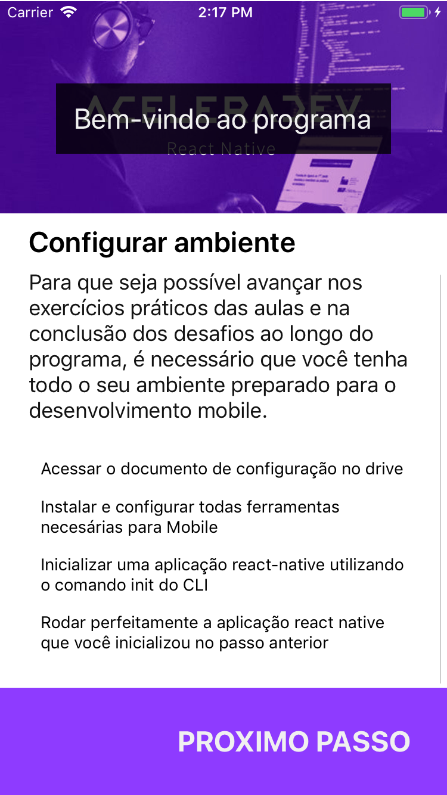

# Componentes e estilos React Native

> Leia atentamente as instruções abaixo, pois elas te
levarão a encontrar a resolução esperada para o desafio

Tópicos
---

Com esse desafio, você aprenderá:

- API React Native
- Componentes nativos do React Native

Requisitos
---

Este projeto é um aplicativo usado para mostrar os passos esperados
que os integrantes do programa #AceleraDev de React Native precisam
realizar antes de iniciar as aulas. Essas informações estão todas na
aplicação, de forma estática, através de um arquivo JSON no código,
que está sendo lido na aplicação, e apresentado somente os passos
à serem realizados com seus respectivos textos, porém algumas
funcionalidades estão faltando ou incompletas na aplicação. 

Então, o objetivo é que com esse desafio você consiga evoluir a
aplicação, completando as funcionalidades que estão faltando, e
introduzindo novas funcionalidades esperadas, utilizando o
conhecimento de react, e dos componentes e estilos no React Native
aprendidos em aula, ou através das fontes de referência passadas em aula.

### Tarefas

- [ ] Adicionar a listagem de instruções na tela para cada passo apresentado



- [ ] Adicionar funcionalidade de esconder e mostrar a listagem de instruções


- [ ] Adicionar a possibilidade de marcar uma instrução como completada através de um `<Switch />`,
não sendo possível desmarcar após completar a instrução


- [ ] Ao completar uma instrução, o texto da instrução deve ser sublinhado


- [ ] Ao finalizar as instruções de todos os passos, deve-se mostrar novamente a tela inicial (`<Home />`)
e não deve ser possível voltar a tela de passos

Instruções
---

> Todas as configurações necessárias já foram criadas, se sentir
falta de algo, contate os instrutores/mentores.

- Tenha certeza que você está na pasta do projeto:

```bash
$ cd $PASTA_DO_PROJETO
```

- Tenha a versão correta do Node instalada e use-a para o projeto:

> ^12.16.1 (lts/erbium)

```bash
$ nvm install # to install and use the project node version specified .nvmrc
```

- Instalando as dependências do projeto:

**Node (React Native):**

> Tenha certeza que você está utilizando corretamente as versões
correspondentes

- CocoaPods: ^1.8
- yarn: ^1.17.3

_Tenha certeza que você está usando a versão correta do yarn_

> Não está habilitado ou permitido usar a versão 3 do yarn

```bash
$ yarn --version # to display the current yarn version
```

_Para instalar as dependências do node, configuradas no projeto,
basta você estar na pasta do projeto e executar o comando do yarn
para instalar as depedências do node configurada no `package.json`,
através do seguinte comando:_

```bash
$ yarn # to install the lock dependencies at yarn
```

**iOS:**

_Se você estiver no MacOS, você precisará instalar as dependências
do iOS através do cocoapods, então tenha certeza que você tem instalado
corretamente a versão 1.8+ do cocoapods localmente:_

```bash
$ pod --version # to display the current cocoapods version
```

_Para instalar as dependências do iOS com o cocoapods, basta você
entrar na pasta do `ios` no projeto e executar o comando do cocoapods
para instalar dependencias através do seguinte comando:_

```bash
$ cd ios/ # to open the iOS project directory
$ pod install # to display the current cocoapods version
```

- React Native Debugger: 

```bash
$ yarn open:debugger  # to open the react-native-debugger
```

- Toda a estrutura básica necessária para o projeto 
está na pasta `/src`:

> Você deve, e pode evoluir essa estrutura da maneira que você
achar e julgar necessária para evoluir e cumprir os requisitos
esperados para o desafio, o que você não pode fazer, pois pode 
afetar sua nota, é excluir ou modificar os nomes dos componentes
que já existem.

```unicode
.
├── src/
|   └── App.js # Componente responsável por renderizar a aplicação
|   └── config.js # Arquivo com variáveis de configuração de ambiente
|   └── styles.js # Arquivo com as definições e configurações de estilos da aplicação
|   └── steps.json # Arquivo JSON estático com os passos e instruções do programa, à serem mostrados no app
|   ├── components/ # Pasta de componentes reutilizáveis da aplicação 
|       └── LoookSteps/ # Componente responsável por renderizar o fluxo de passos
|       └── Step/ # Componente responsável por renderizar cada passo
|       └── StepDescription/ # Componente responsável por renderizar a descrição do passo
|       └── StepTitle/ # Componente responsável por renderizar o titulo do passo
|       └── Steps/ # Componente responsável por renderizar todos os passos através de um fluxo uni-direcional
|       └── ForwardStep/ # Botão responsável por avançar os passos
```

- Você pode usar os testes pra lhe auxiliar no desenvolvimento
do desafio, e garantir que suas correções tiveram o efeito esperado:

**Rodando todos os testes:**

> Usando este modo, todos os testes serão executados todos de uma vez, um por um

```bash
$ yarn test # or npm test
```

**Rodando os testes em desenvolvimento:**

> Usando este modo, os testes serão re-executados a cada mudança feita
no código

```bash
$ yarn test:watch # or npm run test:watch
```

- Para iniciar o packager para desenvolvimento com metro bundler: 

```bash
$ yarn start # or npm start
```

_Se você querer abrir por padrão o react native debugger,
execute o seguinte comando:_

```bash
$ REACT_DEBUGGER="yarn open:debugger" yarn start 
```

**Windows:**

```bash
$ set REACT_DEBUGGER="yarn open:debugger" && yarn start 
```

- Para buildar e testar a aplicação:

**iOS:**

```bash
$ yarn react-native run-ios
```

_Se você querer rodar em um modelo especifico no simulador,
execute o seguinte comando:_

```bash
$ yarn react-native run-ios --simulator "iPhone 7"
```

_Se você querer rodar o aplicativo iOS em um dispositivo fisico,
você precisará utilizar o `ios-deploy`, disponível para download
no npm, então basta executar o seguinte comando para instalar o
`ios-deploy` globalmente:_

```bash
$ npm install -g ios-deploy # to install `ios-deploy` globally to use it directly
```

_Agora, você precisa se certificar que seu dispositivo está conectado
e sincronizado corretamente com seu computador, então basta você copiar
o nome do dispositivo fisico conectado, através do seguinte comando:_

> Para ter certeza que seu dispositivo será acessado corretamente,
tenha certeza que o telefone esteja desbloqueado

```bash
$ ios-deploy --detect # to get and display the connected device
```

O resultado do comando acima, deve se parecer com a imagem abaixo:

> No caso da imagem abaixo, o nome do dispositivo é `Renato's iPhone`,
como selecionado e demarcado para facilitar a visualização


_Agora, através do nome do dispositivo que você copiou no comando à cima,
você poderá usá-lo para instalar e abrir o aplicativo neste dispositivo,
através do seguinte comando:_

```bash
$ yarn react-native run-ios --device "Renato’s iPhone"
```

**Android:**

```bash
$ yarn react-native run-android
```

_Se você estiver usando um aparelho fisico android,
execute o seguinte comando:_

```bash
$ yarn android:ports
```
